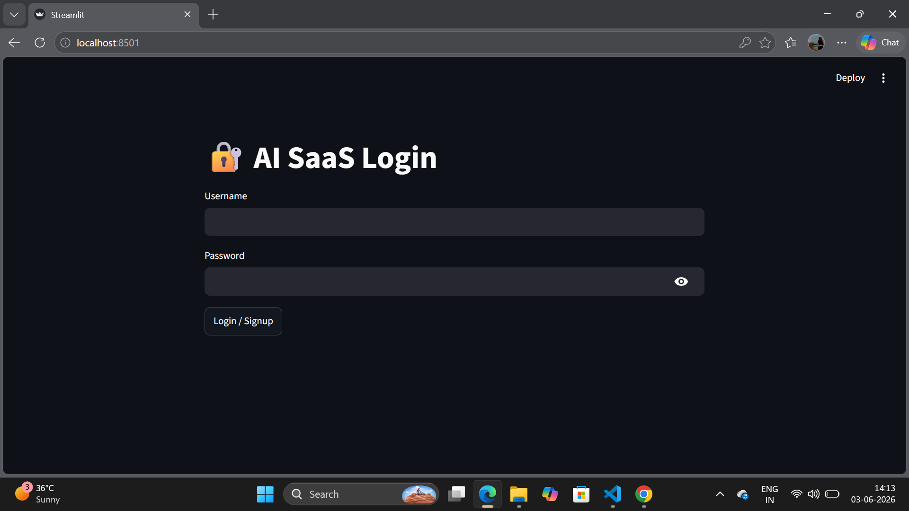

HEAD

# 🤖 Smart Meta AI Chatbot

A Python-based Meta AI style chatbot built using Tkinter.

## Features

* Smart AI Chat Interface
* Dark Meta AI Style UI
* Math Calculations
* Date & Time
* Motivational Replies
* Jokes
* Chat Memory
* Scrollable Chat
* Clear Chat Feature

## Technologies Used

* Python
* Tkinter
* Threading

## Run Project

```bash
py chatbot.py
```
## 📸 Screenshots

### 🏠 Home Page


### 🔐 Login Page


### 💬 Chat_Interface


### ⚠️ Limitations Page

---
## Author

Vanshika Kaushik
# DecodeLabs-Internship

